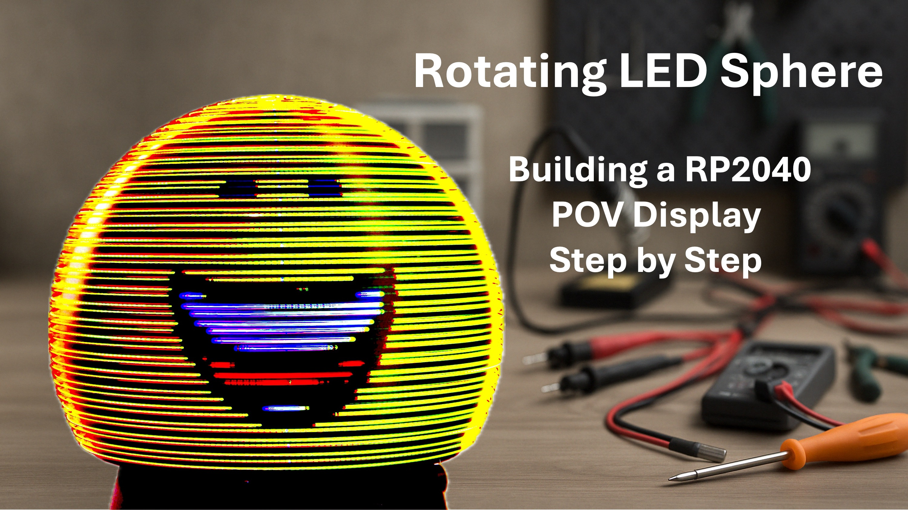

# Rotating LED Sphere – RP2040 POV Display

**UPDATE April 30th, 2025**
@randybeever5206 made me aware (**thank you!**), that the value of R403, R404, and R405 on the main display board should be 270 Ohm according to the schematic, but the properties field and the corresponding line in the production file refers to a 1k resistor instead. Let me explain:

1. these three resistors set the forward peak current of the LEDs. 1k corresponds to 20 mA, 270 Ohms corresponds to 75 mA. 
2. I had copied this part of the schematic from an earlier project, changed the value but missed to change the component in the production data. As a result, I worked with 20mA, although I thought it was 75.
3. I have changed the resistors in my unit from 1k to 270 Ohm in the meantime (what a pain: these are 0402 resistors!). Yes, it is brighter. But it comes with a complication: if you set the brightness in the user interface too high, the processor crashes. I am not sure yet, why that happens. My guess is that the voltage breaks down, as the power conspumtion goes up with higher brightness, obviously. I will further look into this, but it needs some time.
4. Here is my recommendation: use 270 Ohm resistors. Even if you reduce the brightness setting, so that the device works flawlessly, it is brighter than before (with 1k). It should not be a big deal to limit the brightness in the software.
5. I have updated the schematic and the production file in the meantime.

## 📌 Project Overview

This project describes the design and construction of a **rotating LED sphere** using the **persistence-of-vision (POV)** principle.  
The device is controlled by a **Raspberry Pi RP2040 microcontroller** and is capable of displaying **videos, animated GIFs**, and **static images** on a spherical 3D surface.

The project is inspired by the Las Vegas Sphere – scaled down to desktop size, but packed with smart engineering like **wireless power transmission**, **real-time SDIO video streaming**, and **web-based remote control**.

All hardware, software, PCB layouts and 3D printable parts are **open source** and included in this repository.

---

## ✨ Features

- 🟡 64 RGB LEDs arranged to form a 170 mm spherical POV display  
- 📊 Display resolution: **64 × 256 pixels** **(corrected: it is NOT 128 x 256)**  
- 🎞️ Supports **.rs64** video/image format (GIFs, animations, stills)  
- 💾 Real-time video streaming from **SD card via SDIO (4-bit)**  
- ⚙️ Driven by an **RP2040** using fast **PIO-based multiplexing**  
- 🌐 Optional **ESP01s** module creates a web-based control interface  
- 🔌 **Wireless power** using a Royer converter – no slip rings needed  
- 🧠 Designed to be **easy to build**, with a minimal part count  
- 🧰 All files included: **KiCad PCB**, **PlatformIO code**, **3D models**

---

## 🧱 System Components

- **RP2040 microcontroller** (via Raspberry Pi Pico or custom PCB)  
- **ESP01s (optional)** for Wi-Fi control and web interface  
- **SD card slot** (with high-speed SDIO interface)  
- **24-bit shift register** and **MOSFETs** for LED driving  
- **3D-printed mechanical components** (rotor, housing, mounts)  
- **Wireless power transmission** with printed transmitter/receiver coils  
- **Hall sensor** for rotation angle synchronization  
- **Custom `.rs64` video format** with 8 brightness levels via PWM

---

## 🛠️ How to Build

The build process is documented in a [step-by-step video tutorial](https://www.youtube.com/yourvideolink), covering:

1. Mechanical design & 3D printing  
2. Rotor balancing and alignment  
3. Soldering the LED matrix  
4. Power & wireless energy transmission  
5. Programming the RP2040 and ESP01s  
6. Creating `.rs64` files from GIFs and videos  
7. Using the web interface

For detailed instructions, see the [`docs/`](./docs) folder.

---

## 📜 License

This project is licensed under the **Creative Commons BY-NC-SA 4.0** license.  
You are free to **use, adapt, and share** this work for **non-commercial** purposes,  
as long as you give proper credit and share your work under the same terms.

> ✏️ Especially welcomed: use in education, maker communities, and open-source development!

---

