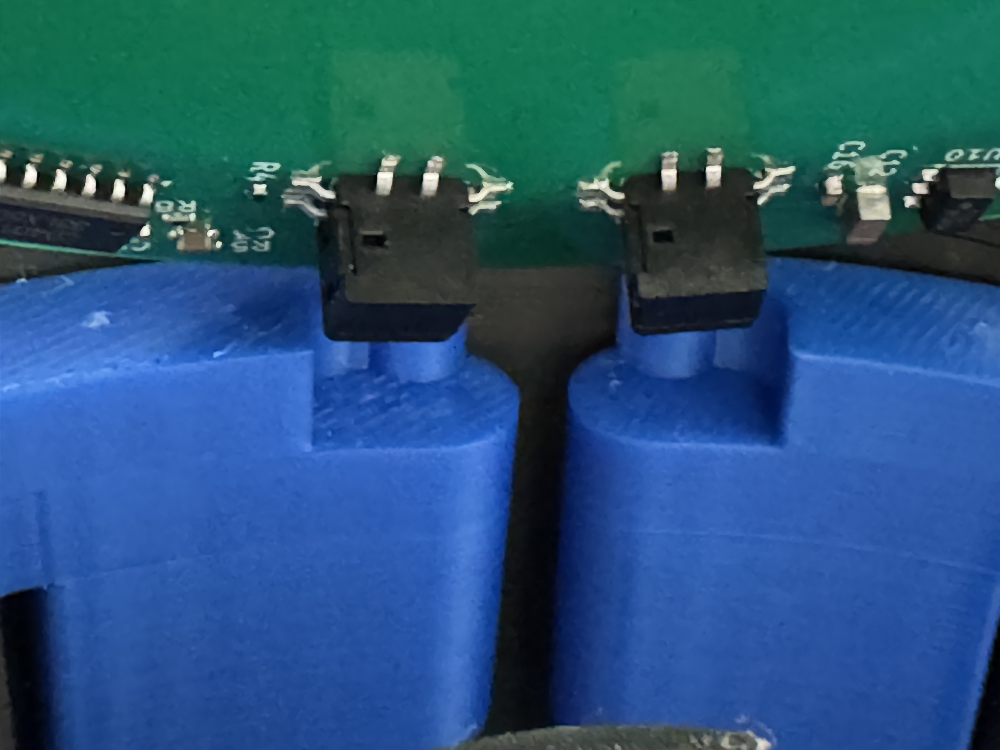
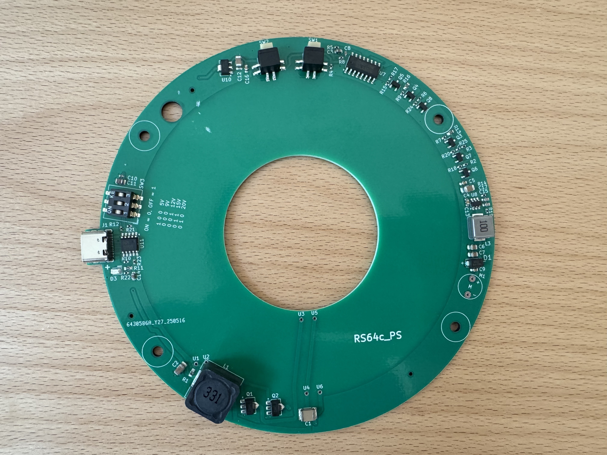

# Rotating LED Sphere – RP2040 POV Display
**UPDATE August 29th, 2025**
There are two push switches on the power supply pcb, that control the speed of the motor. The "speed" button is used to increase the motor speed step by step. Once the maximum speed is reached, it jumps back to zero. The "off" button turns the motor off.

However, The buttons were previously positioned at the same height as the power supply circuit board, very close to the rotating sphere assembly. To reduce the risk of injury, I have moved the buttons to the center of the power supply housing in the latest version of the housing. The movement of the two buttons is transferred to the switches on the circuit board purely mechanically, so that no modification of the circuit board is necessary.

**UPDATE May 29th, 2025**

In the meantime I had the new power supply board built and could test it the last couple of days. **It works fine as expected.** 

Power is now supplied from a **standard USB-C power supply** with power delivery ("PD") function via an off-the-shelf USB-C cable. I am using the Apple power supply of my MacBook. The CH224k for controlling the voltage setting works extremely well. The voltage can be set with a 3 bit dip switch, easily. When set to 15 V, the transmitted energy to the LED board is sufficient even for the highest brightness setting. Of course, the losses of the wireless power transmission show up as heat, but the temperature looks reasonable to me.

The motor power supply has a **stronger step-down converter chip** now (TPS54302 instead of TPS54202 in the old design). The circuit allows for up to 3A of motor current. Furthermore, I introduced a button control logic for setting the motor speed in 5 steps. There are two buttons: increase speed, and OFF. This eliminates the potentiometer and the on/off switch in the old design.

Finally, I **increased the diameter of the circular hole in the middle of the pcb**, which allows for a significantly larger and stronger motor to LED-board connection. The tray disk has a larger diameter now. The 4 holes in the secondary coil pcb are now being used for securing the LED assembly to the motor.

In order to fit the new pcb, I had to modify the housing. Please find the related files in this repository.

**UPDATE May 10th, 2025**
I am currently working on an update of the power supply. The idea is to replace the 12V power plug with an USB-C PD (power delivery) power supply. I am interested in the CH224K, which manages the voltage negotiation with the USB PD. This would allow us to use a standard USB-C charger (probably about 25 - 35 W) for supplying the device. USB power delivery can provide 5, 9, 12, 15, or 20V. This is exactly the range needed for the rotating sphere. At the same time I will replace the motor power regulator with a stronger one. Currently, the motor current cannot go above 2A, which is just barely sufficient.

If you are interested, stay tuned. However, it will definitely take 4 weeks, probably more, to get it done.

**UPDATE April 30th, 2025**
@randybeever5206 made me aware (**thank you!**), that the value of R403, R404, and R405 on the main display board should be 270 Ohm according to the schematic, but the properties field and the corresponding line in the production file refers to a 1k resistor instead. Let me explain:

1. these three resistors set the forward peak current of the LEDs. 1k corresponds to 20 mA, 270 Ohms corresponds to 75 mA. 
2. I had copied this part of the schematic from an earlier project, changed the value but missed to change the component in the production data. As a result, I worked with 20mA, although I thought it was 75.
3. I have changed the resistors in my unit from 1k to 270 Ohm in the meantime (what a pain: these are 0402 resistors!). Yes, it is significantly brighter. For some reason, colors look even more saturated, now. The color animation, which can be seen in the video, looks stunning.
4. However, higher brightness means higher power consumption. If you supply the device with a 12 V power plug (12V, 2A), you can not run it at 100% brightness. I found that the processor crashes, when you go too high. This is obviously a voltage breakdown.
5. Fortunately, I designed the power supply such that it can be operated with up to 24V. When you run the sphere with 17V or above, you can go up to 100% brightness.
6. Here is my recommendation: use 270 Ohm resistors. If you run the device at 12V, you need to reduce the brightness setting, so that the device works flawlessly. If you want more, you need a power supply with more than 17V, 2 or better 3 A (consumption depends on motor speed).
7. I have updated the schematic and the production file in the meantime.

## 📌 Project Overview

This project describes the design and construction of a **rotating LED sphere** using the **persistence-of-vision (POV)** principle.  
The device is controlled by a **Raspberry Pi RP2040 microcontroller** and is capable of displaying **videos, animated GIFs**, and **static images** on a spherical 3D surface.

The project is inspired by the Las Vegas Sphere – scaled down to desktop size, but packed with smart engineering like **wireless power transmission**, **real-time SDIO video streaming**, and **web-based remote control**.

All hardware, software, PCB layouts and 3D printable parts are **open source** and included in this repository.

---

## ✨ Features

- 🟡 64 RGB LEDs arranged to form a 170 mm spherical POV display  
- 📊 Display resolution: **64 × 256 pixels** **(corrected: it is NOT 128 x 256)**  
- 🎞️ Supports **.rs64** video/image format (GIFs, animations, stills)  
- 💾 Real-time video streaming from **SD card via SDIO (4-bit)**  
- ⚙️ Driven by an **RP2040** using fast **PIO-based multiplexing**  
- 🌐 Optional **ESP01s** module creates a web-based control interface  
- 🔌 **Wireless power** using a Royer converter – no slip rings needed  
- 🧠 Designed to be **easy to build**, with a minimal part count  
- 🧰 All files included: **KiCad PCB**, **PlatformIO code**, **3D models**

---

## 🧱 System Components

- **RP2040 microcontroller** (via Raspberry Pi Pico or custom PCB)  
- **ESP01s (optional)** for Wi-Fi control and web interface  
- **SD card slot** (with high-speed SDIO interface)  
- **24-bit shift register** and **MOSFETs** for LED driving  
- **3D-printed mechanical components** (rotor, housing, mounts)  
- **Wireless power transmission** with printed transmitter/receiver coils  
- **Hall sensor** for rotation angle synchronization  
- **Custom `.rs64` video format** with 8 brightness levels via PWM

---

## 🛠️ How to Build

The build process is documented in a [step-by-step video tutorial](https://www.youtube.com/yourvideolink), covering:

1. Mechanical design & 3D printing  
2. Rotor balancing and alignment  
3. Soldering the LED matrix  
4. Power & wireless energy transmission  
5. Programming the RP2040 and ESP01s  
6. Creating `.rs64` files from GIFs and videos  
7. Using the web interface

For detailed instructions, see the [`docs/`](./docs) folder.

---

## 📜 License

This project is licensed under the **Creative Commons BY-NC-SA 4.0** license.  
You are free to **use, adapt, and share** this work for **non-commercial** purposes,  
as long as you give proper credit and share your work under the same terms.

> ✏️ Especially welcomed: use in education, maker communities, and open-source development!

---

